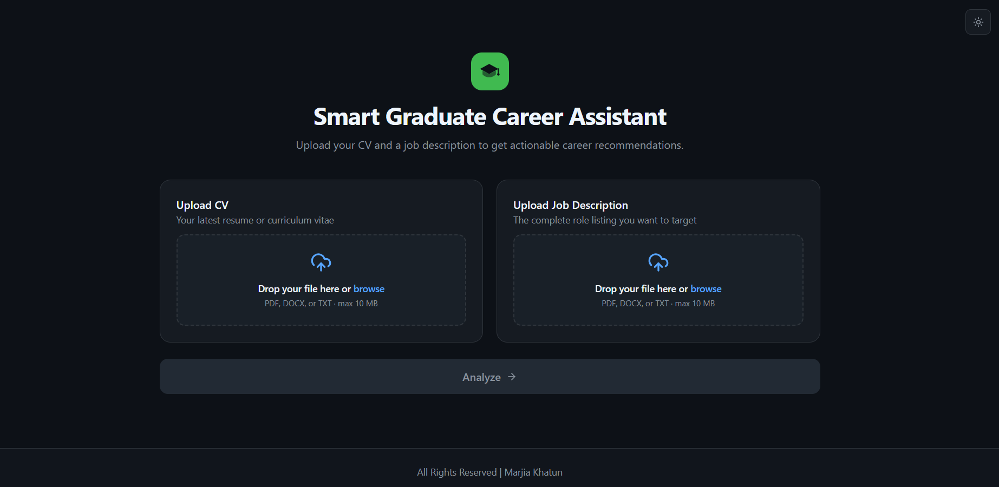
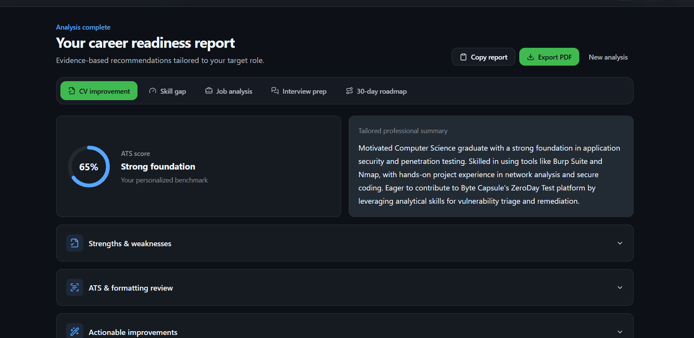
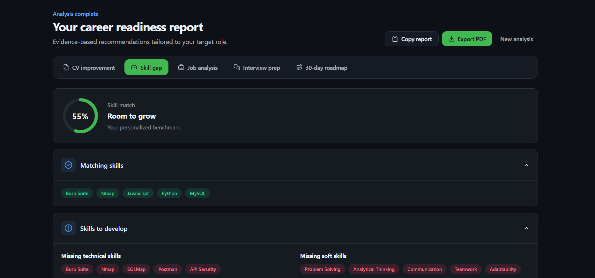
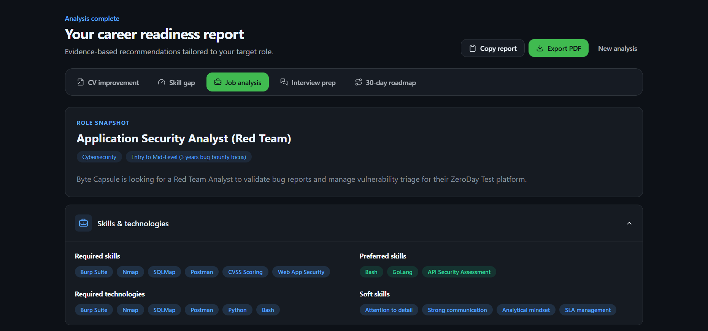
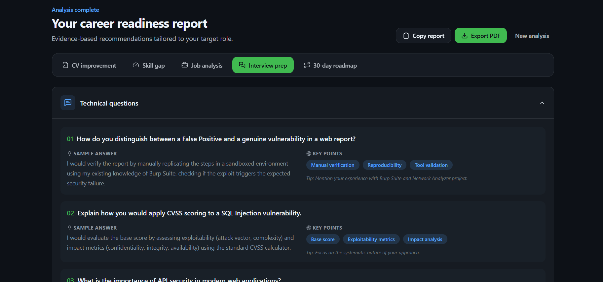
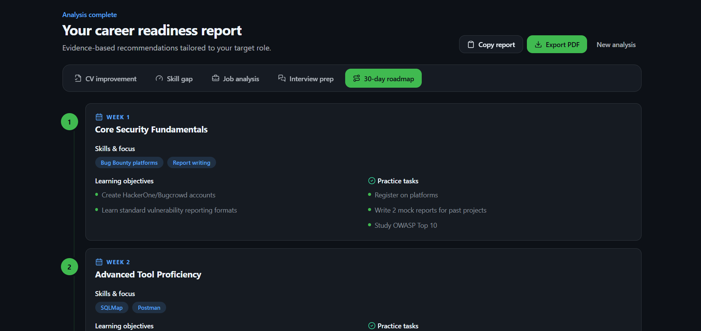

# Smart-Graduate-Career-Assistant

An AI-powered web application developed as part of the **SSL Wireless Training Assessment** during Session 16: **"Practical AI Tools for Smarter Work."** The project followed an end-to-end AI-powered development workflow using **Perplexity, ChatGPT, and Base44**.

## Development Phases

### Phase 1: Research and Market Analysis

Used **Perplexity** to research the job market, hiring trends, common CV mistakes, and challenges faced by fresh graduates.

### Phase 2: Requirements and Feature Specifications

Used **ChatGPT** to define the product requirements and core features of the application.

### Phase 3: Build and Deployment

Used **Base44** to build and deploy the complete web application using a vibe-coding workflow.

## Features

- Upload CV and Job Description
- CV Improvement
- Skill-Gap Identification
- Job-Description Analysis
- Interview-Question Generation
- 30-Day Learning Roadmap

## Screenshots

### Upload CV and Job Description

### CV Improvement

### Skill-Gap Identification

### Job-Description Analysis

### Interview-Question Generation

### 30-Day Learning Roadmap

## Tools Used

- **Perplexity** - Research and Market Analysis
- **ChatGPT** - Requirements and Feature Specifications
- **Base44** - Build and Deployment

## Live Application

https://smart-graduate-career-assistant.base44.app/

## Contact
- **Email**: marjiakhatun.my@gmail.com
- **LinkedIn**: https://www.linkedin.com/in/marjia-khatun/
